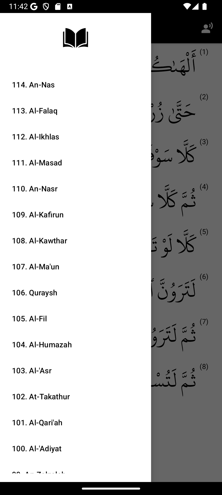
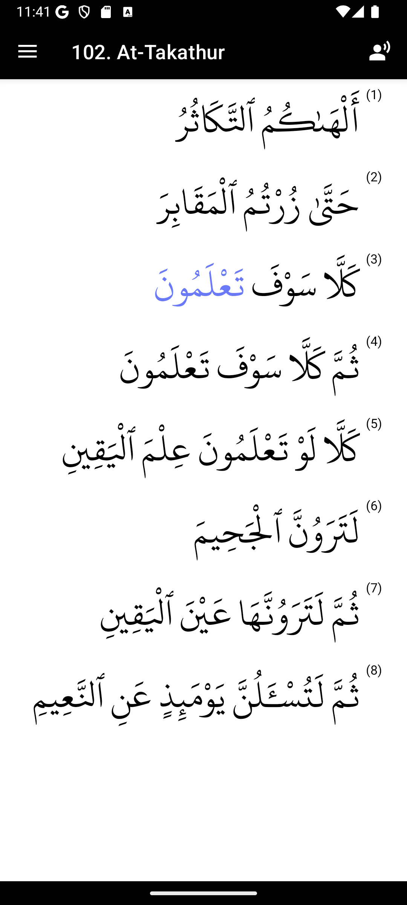

<p align="center">
  
</p>
<h1 align="center">Quran Mom</h1>

Simple app that recites the word by tapping it or starts reciting from that word by swipping left.

This app was created and adapted specifically for my mom to help her listen carefuly and learn the words.

It only has the last juz.

## Screenshots

<p align="center">
  
  
</p>

## Local development

Just clone the repo and open it in Android Studio. Nothing extra used :)

```
git clone https://github.com/ISMAELHADDAD/quran-mom.git
```

Database it's stored in `app/src/main/assets/last_juz.db` and contains:
- All words.
- Audio files urls to download the first time the app is opened.
- The audio segments in miliseconds for each word for each reciter.

## Credits

- Audios from https://quranicaudio.com/about and https://github.com/quran
- Font and words database from https://qul.tarteel.ai